# Release Process Flow Diagram

```mermaid
graph TD
    %% Development Phase
    A[Developer on 'dev' branch] --> B[Feature Development]
    B --> C[Create PR to dev]
    C --> D[Code Review & Merge]
    D --> E[Ready for Release?]
    E -->|No| B
    E -->|Yes| F[Merge dev to main]
    
    %% Release Initiation
    F --> G[Developer on main branch]
    G --> H{Release Method}
    H -->|Automated| I[bin/release 1.1.0]
    H -->|Manual| J[Manual Version Update]
    
    %% Automated Release Script
    I --> K[Update version.rb]
    K --> L[Update CHANGELOG.md]
    L --> M[Run Tests]
    M --> N{Tests Pass?}
    N -->|No| O[Fix Issues & Retry]
    N -->|Yes| P[Commit Changes]
    P --> Q[Create Git Tag v1.1.0]
    Q --> R[Push to GitHub]
    
    %% Manual Release Process
    J --> S[Edit version.rb manually]
    S --> T[Edit CHANGELOG.md manually]
    T --> U[Commit & Tag manually]
    U --> R
    
    %% GitHub Actions Trigger
    R --> V[GitHub detects tag push]
    V --> W[Trigger release.yml workflow]
    
    %% Release Workflow (release.yml)
    W --> X[Setup Ruby Environment]
    X --> Y[Install Pandoc]
    Y --> Z[Run Full Test Suite]
    Z --> AA{Tests Pass?}
    AA -->|No| BB[❌ Workflow Fails]
    AA -->|Yes| CC[Extract Version from Tag]
    CC --> DD[Verify Version Consistency]
    DD --> EE{Version Match?}
    EE -->|No| FF[❌ Version Mismatch Error]
    EE -->|Yes| GG[Extract Changelog Entry]
    GG --> HH{Changelog Exists?}
    HH -->|No| II[❌ Missing Changelog Error]
    HH -->|Yes| JJ[Build Gem File]
    JJ --> KK[Create GitHub Release]
    KK --> LL[Upload Gem as Asset]
    
    %% Publish Workflow Trigger
    LL --> MM[GitHub Release Created]
    MM --> NN[Trigger publish.yml workflow]
    
    %% Publish Workflow (publish.yml)
    NN --> OO[Setup Ruby Environment]
    OO --> PP[Authenticate via Trusted Publishers]
    PP --> QQ{OIDC Auth Success?}
    QQ -->|No| RR[❌ Authentication Failed]
    QQ -->|Yes| SS[Build & Publish to RubyGems]
    SS --> TT{Publish Success?}
    TT -->|No| UU[❌ Publishing Failed]
    TT -->|Yes| VV[✅ Gem Published to RubyGems.org]
    
    %% Final State
    VV --> WW[🎉 Release Complete!]
    WW --> XX[Users can install new version]
    
    %% Styling
    classDef processBox fill:#e1f5fe,stroke:#01579b,stroke-width:2px
    classDef decisionBox fill:#fff3e0,stroke:#e65100,stroke-width:2px
    classDef errorBox fill:#ffebee,stroke:#c62828,stroke-width:2px
    classDef successBox fill:#e8f5e8,stroke:#2e7d32,stroke-width:2px
    classDef automationBox fill:#f3e5f5,stroke:#7b1fa2,stroke-width:2px
    
    class A,B,C,D,F,G,I,J,K,L,P,Q,R,S,T,U,V,W,X,Y,Z,CC,DD,GG,JJ,KK,LL,MM,NN,OO,PP,SS processBox
    class E,H,N,AA,EE,HH,QQ,TT decisionBox
    class O,BB,FF,II,RR,UU errorBox
    class VV,WW,XX successBox
    class M,Z automationBox
```

## Key Components

### 🔧 **Development Tools**
- **dev branch**: Primary development branch
- **bin/release**: Automated release script
- **version.rb**: Single source of truth for version
- **CHANGELOG.md**: Required for release notes

### ⚙️ **GitHub Actions Workflows**
- **ci.yml**: Continuous integration testing
- **release.yml**: Creates GitHub releases
- **publish.yml**: Publishes to RubyGems via Trusted Publishers

### 🔐 **Authentication (Automatic)**
- **GITHUB_TOKEN**: Built-in, no setup required
- **Trusted Publishers**: OIDC-based RubyGems authentication
- **Zero stored credentials**: All authentication is automatic

### 📦 **Outputs**
- **GitHub Release**: With changelog and gem file
- **RubyGems Package**: Available for `gem install`
- **Git Tags**: Permanent version markers

## Critical Success Factors

1. **Version Consistency**: Tag must match version.rb and gemspec
2. **Changelog Entry**: Required for each release
3. **Test Passing**: Full test suite must pass
4. **Trusted Publishers**: Must be configured on rubygems.org

## Error Recovery

- **Test Failures**: Fix code and re-run release
- **Version Mismatch**: Update version.rb or recreate tag
- **Missing Changelog**: Add entry and recreate tag
- **Auth Issues**: Verify Trusted Publishers configuration